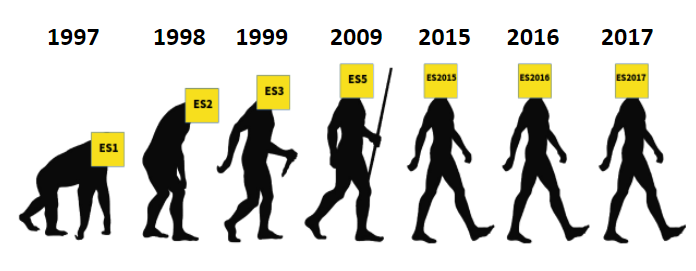

# A TL;DR History of ECMAScript

* **Javascript** - Language created for the Netscape Navigator
* **JScript** - MS implementation for InternetExplorer
* **ECMA** (European Computer Manufacturers Association) - standards organization for information and communication systems
* **ECMAScript** - ECMAScript (or ES) is a scripting-language specification standardized by Ecma International. It was created to standardize JavaScript

# JavaScript Limitations (outdated)

* No package manager (link .js via HTML is risky)
* No standard file system library
* Too dynamic / not typesafe

# NodeJS

* JavaScript runtime environment that executes JavaScript code outside of a web browser
* Node.js lets developers use JavaScript to write command line tools and for server-side scripting

# NPM - Node Package Manager

* Package manager for the JavaScript programming language
* Can be used to package:
  * server app (Express, NestJS)
  * webapp (Angular, ReactJS, VueJS)
  * desktop app (Electron)

# ExpressJS

* Express.js is a web application framework for Node.js
* It is designed for building web applications and APIs

# Typescript

* TypeScript is an open-source programming language developed and maintained by Microsoft
* It is a strict syntactical superset of JavaScript, and adds optional static typing to the language
* Needs to be *transpiled* before it can run in the browser (or by NodeJS)

# References

* https://medium.com/sfl-newsroom/ecmascript-from-roots-to-ecmascript-2017-ce92afc96447
* https://en.wikipedia.org/wiki/ECMAScript
* https://en.wikipedia.org/wiki/Ecma_International
* https://en.wikipedia.org/wiki/TypeScript
* https://en.wikipedia.org/wiki/Node.js
* https://nodejs.dev/a-brief-history-of-nodejs
* https://nodejs.dev/differences-between-nodejs-and-the-browser